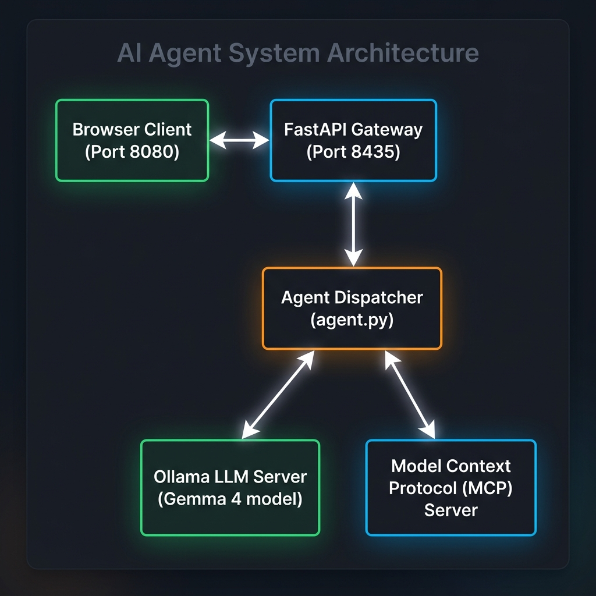
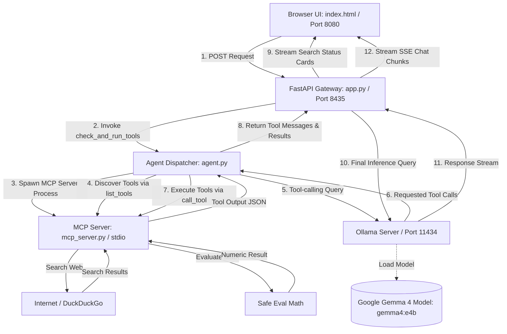
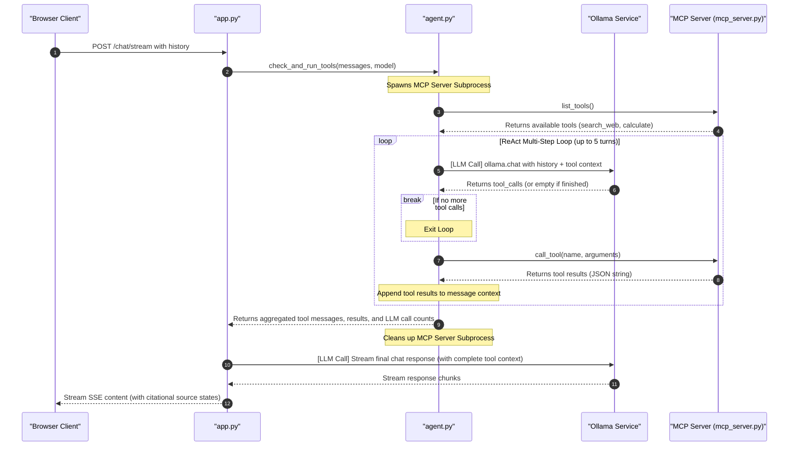
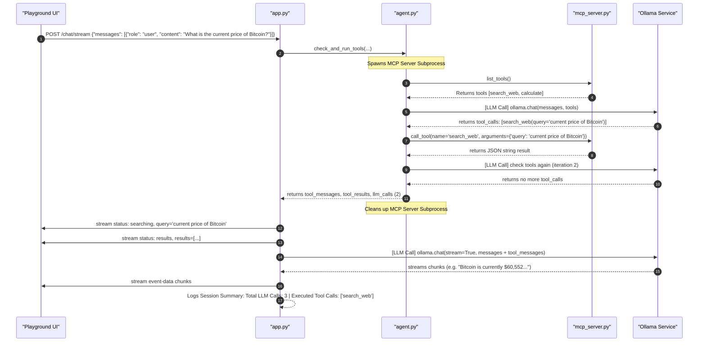
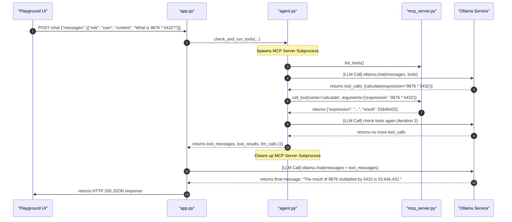
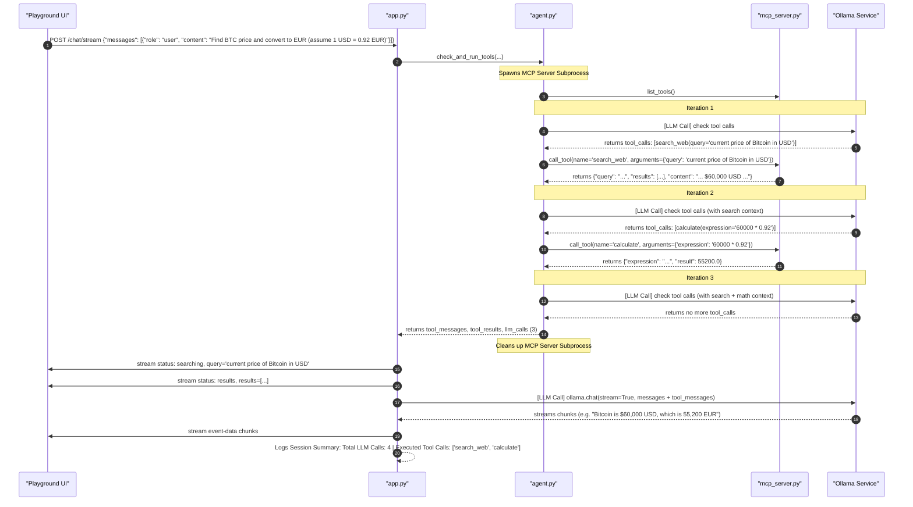
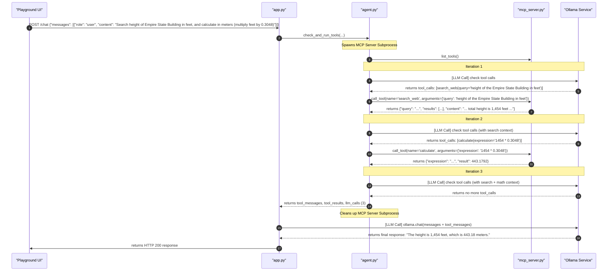

# GemmaJnana


A local development stack to download, serve, and interact with Google's **Gemma 4 (Effective 4B)** model using **Ollama** and an asynchronous **FastAPI** gateway. The package includes a Model Context Protocol (MCP) tools server and a beautiful, fully animated chat playground UI.

---

## Project Architecture Flow

Below is the visual flow of the GemmaJnana local architecture.



### Data Flow Diagram



### Agentic Search Call Flow Diagram



### Components Description

*   **`start.sh`**: The master automation script. It:
    1. Checks if Ollama is installed and automatically updates it to the latest version if needed.
    2. Starts the Ollama service.
    3. Verifies and pulls the `gemma4:e4b` model.
    4. Automatically verifies and installs Python dependencies (`fastapi`, `uvicorn`, `ollama`, `ddgs`, `mcp`, `fastmcp`).
    5. Launches the FastAPI server in the background.
    6. Serves the web interface in the foreground.
*   **`stop.sh`**: Gracefully terminates all background servers (Ollama, FastAPI app, and the lightweight HTTP server).
*   **`mcp_server.py`**: Model Context Protocol (MCP) tools server built with Anthropic's `fastmcp`. Exposes search and arithmetic calculators dynamically over `stdio` transport.
*   **`app.py`**: Asynchronous FastAPI gateway that exposes health checks (`/health`), text completions (`/chat`), and SSE-based chunk streaming (`/chat/stream`).
*   **`agent.py`**: Asynchronous agent runner containing the unified `check_and_run_tools` loop, which dynamically spawns the MCP server, queries tool schemas, dispatches tool execution requests, and compiles the tool history sequence.
*   **`index.html`**: A premium dark-themed web playground featuring custom typography, responsive design, search settings selector, search status cards, and clickable source citation chips. Upgraded to protect and render inline/block LaTeX mathematical formulas (`KaTeX`) for both user and assistant message bubbles.

---

## What you can and cannot do

Before running the application, it is important to understand what local LLMs are good at and where they fail:

| What you CAN do with Local LLMs | What you CANNOT do with Local LLMs |
| :--- | :--- |
| **Complete Privacy**: Since everything is running on your machine itself, your private code, emails, or personal data never goes to any server outside. | **High speed on old hardware**: If your laptop does not have minimum 8GB/16GB RAM or GPU cores (like Apple Silicon or Nvidia), the response will be very slow. |
| **Works 100% Offline**: You can use the model on a flight, train, or when your wifi is down. No active internet is needed after downloading the model. | **Handling massive documents**: Small local models have limited memory (context window) and will forget details if the chat becomes too long. |
| **Live Web Search (New!)**: The agent can automatically query the internet (via DuckDuckGo) for real-time information, render active source cards, and synthesize current responses with citations. | **Very complex logic**: Small models (like 4B parameters) are amazing for normal coding support and general writing, but they struggle with complex math or heavy logic tasks. |
| **Zero Bills**: There is no token cost or monthly subscription. It is fully free of cost. | **Generate images directly**: These local LLMs are text-only. They cannot generate images or diagrams directly (you need separate diffusion models for that). |
| **Fast testing**: You can tweak python backend parameters or system instructions as much as you want without worrying about API limits. | |
| **Generate text and code**: Write summaries, emails, clean python scripts, and format tables easily. | |

---

## Agentic Web Search & Math Features

GemmaJnana features robust agentic tool capabilities:
1. **Dynamic Tool Calling**: Tools are loaded dynamically via Model Context Protocol. The local Gemma model natively decides if the query needs live internet search or math calculations.
2. **Search UI Indicators**: The web client streams the search status in real-time. When searching, a pulsing loading state is shown. Once results are fetched, active link cards (source chips) are rendered right inside the chat bubble.
3. **LaTeX Math Rendering**: Inline and block math expressions are fully protected from markdown compiler collisions and rendered using KaTeX.
4. **Citations & Bibliography**: Answers generated using search are cited in-line (e.g. `[1]`, `[2]`), and a bibliography of sources is displayed at the bottom.

---

## Prerequisites

To run this application, make sure you have:
1.  **macOS** (since automated updates look for `/Applications/Ollama.app`).
2.  **Python 3.x** with the required libraries:
    ```bash
    pip install fastapi uvicorn ollama mcp fastmcp
    ```

---

## How to Run

1.  **Start the entire service stack**:
    ```bash
    ./start.sh
    ```
    This script will take care of updating Ollama, downloading the model, checking dependencies, and launching the servers.

2.  **Open the Web Playground**:
    Navigate to [**`http://localhost:8080`**](http://localhost:8080) in your browser.

3.  **Graceful shutdown**:
    To shut down the web server, press `Ctrl+C` in your terminal. Alternatively, to ensure all background processes (FastAPI, Ollama) are stopped, run:
    ```bash
    ./stop.sh
    ```

---

## API Reference

The FastAPI gateway runs at `http://127.0.0.1:8435` and offers the following endpoints:

*   `GET /health`: Diagnoses connection health and returns active model metadata.
*   `POST /chat`: Completes message requests (non-streaming).
*   `POST /chat/stream`: Initiates an SSE (`text/event-stream`) chat channel.

---

## Step-by-Step Code Execution Trace (Debugging Walkthrough)

To make it easy to follow the flow of control, here is a step-by-step trace showing exactly how inputs and outputs travel through the codebase for different scenarios.

---

### Scenario A: Web Search Trigger
**User Prompt:** `"What is the current price of Bitcoin?"`



#### **Step 1: Frontend Request**
The user clicks send. The browser client (`index.html`) intercepts the submit and issues an HTTP `POST` to `/chat/stream` with the conversation history.
*   **Payload sent to `POST /chat/stream`:**
    ```json
    {
      "messages": [
        {"role": "user", "content": "What is the current price of Bitcoin?"}
      ],
      "temperature": 0.3
    }
    ```

#### **Step 2: Gateway Entry (`app.py`)**
The `chat_stream` function in `app.py` receives the payload, converts it to a standard python list of dictionaries, and calls the agent runner:
*   **Input to `check_and_run_tools()`:**
    *   `messages_list`: `[{"role": "user", "content": "What is the current price of Bitcoin?"}]`
    *   `model_name`: `"gemma4:e4b"`

#### **Step 3: MCP Subprocess Spawning & Tool Discovery (`agent.py`)**
Inside `check_and_run_tools()`, the agent starts `mcp_server.py` and fetches its tools:
*   **Discovery:**
    The agent calls `session.list_tools()` and maps the MCP result schemas dynamically to Ollama's tool schemas.
*   **Ollama Chat Call:**
    The agent sends the history and active tool definitions to Ollama:
    ```python
    response = await client.chat(
        model="gemma4:e4b",
        messages=[{"role": "user", "content": "What is the current price of Bitcoin?"}],
        tools=ollama_tools,
        options={"temperature": 0.0}
    )
    ```
*   **Ollama Output (Response Metadata):**
    Because the prompt asks for real-time information ("current price"), the Gemma model outputs a `tool_calls` block:
    ```json
    {
      "message": {
        "role": "assistant",
        "content": "",
        "tool_calls": [
          {
            "type": "function",
            "function": {
              "name": "search_web",
              "arguments": {"query": "current price of Bitcoin"}
            }
          }
        ]
      }
    }
    ```

#### **Step 4: Tool Execution (`mcp_server.py`)**
The dispatcher identifies `search_web` in the requested tool calls, and executes it via the MCP client:
*   **Call:** `await session.call_tool("search_web", arguments={"query": "current price of Bitcoin"})`
*   **Output from MCP Server:**
    ```json
    {
      "query": "current price of Bitcoin",
      "results": [
        {"title": "Bitcoin Price Today...", "href": "https://coinmarketcap.com/...", "body": "...price is $60,552..."}
      ],
      "content": "Search Results for 'current price of Bitcoin':\n\n[1] Title: Bitcoin Price Today...\nURL: https://...\nSnippet: ...price is $60,552...\n\n"
    }
    ```

#### **Step 5: Message Compilation (`agent.py`)**
The dispatcher maps the result to the history sequence:
*   **Output `tool_messages` returned from `check_and_run_tools()`:**
    ```json
    [
      {
        "role": "assistant",
        "content": "",
        "tool_calls": [
          {
            "type": "function",
            "function": {
              "name": "search_web",
              "arguments": {"query": "current price of Bitcoin"}
            }
          }
        ]
      },
      {
        "role": "tool",
        "name": "search_web",
        "content": "Search Results for 'current price of Bitcoin':\n\n[1] Title: Bitcoin Price Today...\nURL: https://...\nSnippet: ...price is $60,552...\n\n"
      }
    ]
    ```

#### **Step 6: UI Streams and Final Inference (`app.py` & Ollama)**
1. `app.py` reads the returned `tool_results` dictionary, detects `"search_web"`, and immediately yields status frames so the client UI displays the search card and source links.
2. `app.py` appends `tool_messages` to the message history and initiates the final model chat request:
    *   **Final Chat Request to Ollama:**
        ```python
        stream = await client.chat(
            model="gemma4:e4b",
            messages=[
              {"role": "user", "content": "What is the current price of Bitcoin?"},
              {"role": "assistant", "content": "", "tool_calls": [...]},
              {"role": "tool", "name": "search_web", "content": "..."}
            ],
            stream=True
        )
        ```
3. Ollama processes the combined prompt containing the user question and the injected search results, generating a final text completion citing `[1]` inline.
4. `app.py` streams the completed completion chunks back to the user's screen in real-time.

---

### Scenario B: Calculator Trigger
**User Prompt:** `"What is 9876 * 5432?"`



#### **Step 1: Frontend Request**
*   **Payload sent to `POST /chat/stream`:**
    ```json
    {
      "messages": [
        {"role": "user", "content": "What is 9876 * 5432?"}
      ],
      "temperature": 0.3
    }
    ```

#### **Step 2: Tool Dispatcher Check (`agent.py`)**
*   **Ollama Chat Call:**
    ```python
    response = await client.chat(
        model="gemma4:e4b",
        messages=[{"role": "user", "content": "What is 9876 * 5432?"}],
        tools=ollama_tools,
        options={"temperature": 0.0}
    )
    ```
*   **Ollama Output (Response Metadata):**
    Because the prompt is a math expression, Gemma requests the `calculate` tool:
    ```json
    {
      "message": {
        "role": "assistant",
        "content": "",
        "tool_calls": [
          {
            "type": "function",
            "function": {
              "name": "calculate",
              "arguments": {"expression": "9876 * 5432"}
            }
          }
        ]
      }
    }
    ```

#### **Step 3: Tool Execution (`mcp_server.py`)**
The dispatcher executes the calculator handler via the MCP client:
*   **Call:** `await session.call_tool("calculate", arguments={"expression": "9876 * 5432"})`
*   **Output from MCP Server:**
    ```json
    {
      "expression": "9876 * 5432",
      "result": 53646432
    }
    ```

#### **Step 4: Message Compilation & Final completion (`agent.py` & `app.py`)**
1. The dispatcher serializes the result directly using `json.dumps()`:
    *   **Compilation:**
        ```json
        [
          {
            "role": "assistant",
            "content": "",
            "tool_calls": [{"type": "function", "function": {"name": "calculate", "arguments": {"expression": "9876 * 5432"}}}]
          },
          {
            "role": "tool",
            "name": "calculate",
            "content": "{\"expression\": \"9876 * 5432\", \"result\": 53646432}"
          }
        ]
        ```
2. `app.py` appends the messages and makes the final completing call to Ollama.
3. Ollama reads the calculator result and outputs: `"The result of 9876 multiplied by 5432 is 53,646,432."` which streams to the user.

---

### Scenario C: Multi-Tool Execution (Search + Calculator)
**User Prompt:** `"Find the current price of Bitcoin in USD and convert it to Euros (assume 1 USD = 0.92 EUR)."`



This represents a multi-turn reasoning trace where the model sequentially uses the output of the first tool to feed the parameters of the second tool.

#### **Step 1: Turn 1 - Triggering Web Search**
The model sees the prompt and realizes it does not know the current price of Bitcoin.
*   **Ollama Chat Call:**
    ```python
    response = await client.chat(
        model="gemma4:e4b",
        messages=[{"role": "user", "content": "Find the current price of Bitcoin in USD and convert it to Euros (assume 1 USD = 0.92 EUR)."}],
        tools=ollama_tools
    )
    ```
*   **Dispatcher (`agent.py`) executes `search_web`:**
    *   **MCP Call:** `await session.call_tool("search_web", arguments={"query": "current price of Bitcoin in USD"})`
    *   **Output:**
        ```json
        {
          "query": "current price of Bitcoin in USD",
          "results": [{"title": "Bitcoin Price today...", "href": "...", "body": "...price is $60,000 USD..."}],
          "content": "Search Results for 'current price of Bitcoin in USD':\n\n[1] Title: ... price is $60,000 USD ..."
        }
        ```

#### **Step 2: Turn 2 - Triggering Calculator**
The conversation history now contains:
1. User prompt
2. Assistant tool call (`search_web`)
3. Tool response (`$60,000 USD`)

The model reads this history. It has found the price ($60,000) and now needs to execute the conversion logic requested by the user ($60,000 * 0.92). It triggers a second tool call:
*   **Ollama Chat Call (Next Turn):**
    ```python
    response = await client.chat(
        model="gemma4:e4b",
        messages=[
            {"role": "user", "content": "Find the current price of Bitcoin in USD and convert it to Euros (assume 1 USD = 0.92 EUR)."},
            {"role": "assistant", "content": "", "tool_calls": [{"type": "function", "function": {"name": "search_web", "arguments": {"query": "current price of Bitcoin in USD"}}}]},
            {"role": "tool", "name": "search_web", "content": "Search Results for 'current price of Bitcoin in USD':\n\n[1] Title: ... price is $60,000 USD ..."}
        ],
        tools=ollama_tools
    )
    ```
*   **Dispatcher (`agent.py`) executes `calculate`:**
    *   **MCP Call:** `await session.call_tool("calculate", arguments={"expression": "60000 * 0.92"})`
    *   **Output:**
        ```json
        {
          "expression": "60000 * 0.92",
          "result": 55200.0
        }
        ```

#### **Step 3: Final Inference Synthesis**
The dispatcher appends the calculator messages to the history. The final prompt context contains both the search results and the arithmetic output:
1. User prompt
2. Assistant `search_web` call
3. Tool `search_web` response (`$60,000`)
4. Assistant `calculate` call
5. Tool `calculate` response (`55200.0`)

*   **Final Ollama Chat Call:**
    Ollama synthesizes the final response:
    > "Based on the search results, the current price of Bitcoin is approximately **$60,000 USD**. Converting this value to Euros using the exchange rate of 1 USD = 0.92 EUR (60000 * 0.92) gives **55,200 EUR**."
*   `app.py` streams the synthesized answer to the browser client in real-time.

---

### Scenario D: Multi-Step ReAct Trace (Empire State Building feet-to-meters)
**User Prompt:** `"Search for the height of the Empire State Building in feet, and calculate the height in meters by multiplying the feet by 0.3048."`



#### **Step-by-Step Execution Log (As-Is)**

```diff
  [app.py:event_generator:84] Received chat stream request. Temperature=0.3
  [app.py:event_generator:86] Message history loaded. Total messages: 1
  [agent.py:check_and_run_tools:44] Spawning MCP server subprocess...
  [agent.py:check_and_run_tools:47] Initializing MCP Client Session...
  [agent.py:check_and_run_tools:66] Discovered 2 tool(s) from MCP server: ['search_web', 'calculate']
+ [agent.py:check_and_run_tools:70] [LLM Call] Checking if the model requests any tool calls (iteration 1)...
  [agent.py:check_and_run_tools:87] Model requested 1 tool call(s) at iteration 1: ['search_web']
  [agent.py:check_and_run_tools:110] Executing tool 'search_web' via MCP with args: {'query': 'height of the Empire State Building in feet'}
  [search_web.py:handler:23] Executing search query: 'height of the Empire State Building in feet'
  [search_web.py:handler:35] Search completed. Found 4 results.
  [agent.py:check_and_run_tools:140] Tool 'search_web' execution completed successfully.
+ [agent.py:check_and_run_tools:70] [LLM Call] Checking if the model requests any tool calls (iteration 2)...
  [agent.py:check_and_run_tools:87] Model requested 1 tool call(s) at iteration 2: ['calculate']
  [agent.py:check_and_run_tools:110] Executing tool 'calculate' via MCP with args: {'expression': '1454 * 0.3048'}
  [calculator.py:handler:23] Executing calculation: '1454 * 0.3048'
  [calculator.py:handler:32] Calculation result: 443.17920000000004
  [agent.py:check_and_run_tools:140] Tool 'calculate' execution completed successfully.
+ [agent.py:check_and_run_tools:70] [LLM Call] Checking if the model requests any tool calls (iteration 3)...
  [agent.py:check_and_run_tools:84] No more tool calls requested by the model at iteration 3.
  [app.py:event_generator:92] Streaming search state: status=searching, query='height of the Empire State Building in feet'
  [app.py:event_generator:94] Streaming search results state.
  [app.py:event_generator:99] Extending history with 4 tool message(s).
+ [app.py:event_generator:102] [LLM Call] Calling Ollama chat stream...
  [app.py:event_generator:118] Stream completed successfully. Sent 335 chunk(s).
  [app.py:event_generator:121] Session Summary: Total LLM Calls: 4 | Executed Tool Calls: ['search_web', 'calculate']
```
